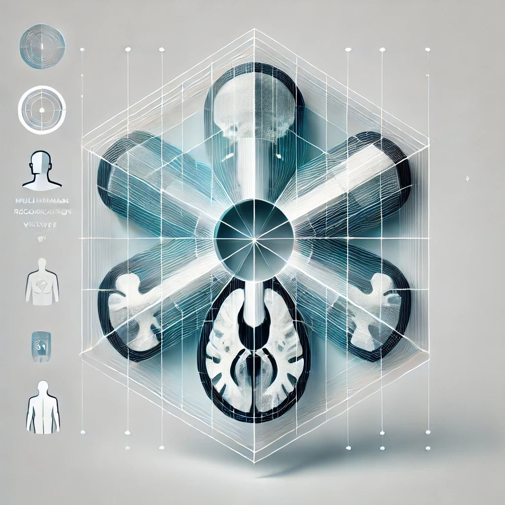
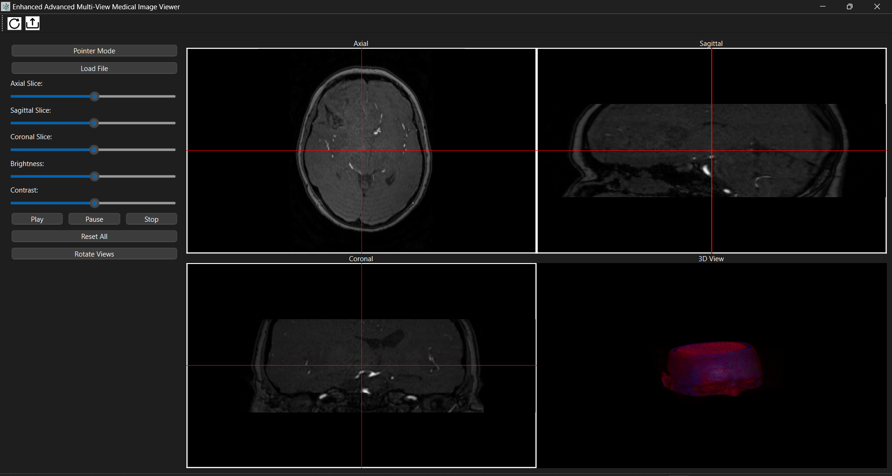
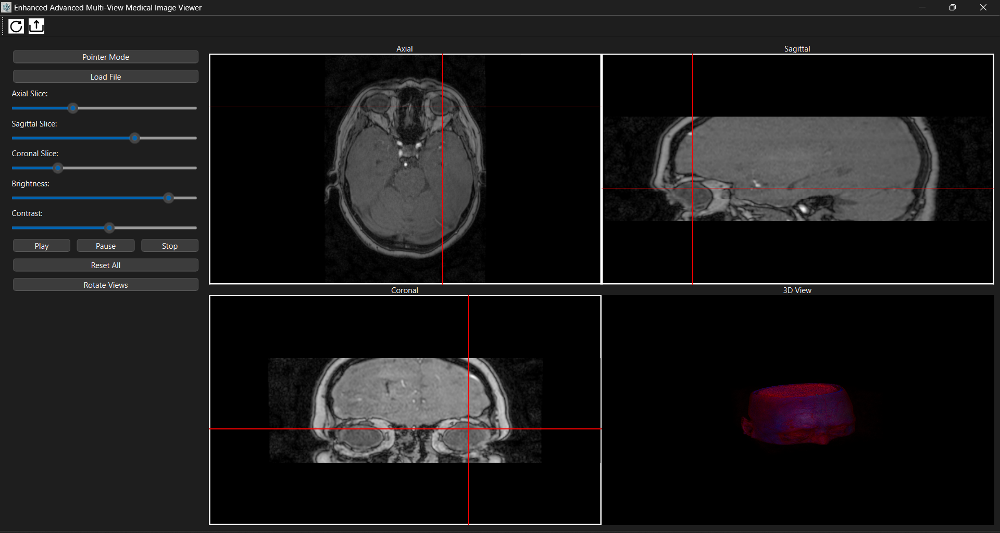

# 🩺 Enhanced Multi-View Medical Image Viewer 🔍  

  

This project is a cutting-edge 🧠 medical imaging application designed to assist professionals and researchers in visualizing and analyzing medical data. It provides advanced tools for viewing imaging data in axial, sagittal, coronal, and 3D formats. The intuitive user interface 🎨 and robust functionality ensure efficient workflows and accurate insights.  

---  

## 🌟 Overview  

The **Enhanced Multi-View Medical Image Viewer** is built to streamline medical imaging tasks. With seamless support for DICOM and NIFTI file formats, it caters to radiologists, researchers, and healthcare professionals. The application features:  

- 🖥️ **Multi-View Modes**: Visualize medical images across multiple planes and in 3D.  
- 🎯 **Advanced Navigation**: Crosshair-based interaction allows precise navigation through voxel data.  
- ⚡ **Customizable Display**: Brightness and contrast controls optimize image visibility.  
- 👥 **User-Friendly Interface**: Easy-to-use tools and a responsive layout simplify complex operations.  

  

*Above: Screenshot of the application's main interface.*  

---  

## 🚀 Features  

### 1. Multi-View Display  
- **🔎 Axial, Sagittal, Coronal Views**: Provides detailed slice-by-slice analysis in three orthogonal planes.  
- **3️⃣ 3D Rendering**: Offers volumetric visualization to explore structures comprehensively.  

### 2. File Format Support  
- 🏥 **DICOM**: Load entire directories of DICOM files.  
- 🧠 **NIFTI**: Supports `.nii` and `.nii.gz` files for advanced neuroimaging studies.  

### 3. Crosshair Navigation  
- ➕ Dynamic crosshair synchronization across views for precise voxel location.  
- 🔄 Real-time updates ensure consistent alignment between different planes.  

### 4. Brightness and Contrast Adjustment  
- 🌟 Adjust gamma and scaling to enhance visualization of critical areas.  
- ⚡ Real-time feedback ensures immediate results.  

  
*Above: Screenshot highlighting the application's features.*  

### 5. Cine Scrolling  
- 🎞️ Automate slice navigation with the mouse to simulate dynamic imaging.  
- 🚀 Perfect for reviewing sequential scans or functional imaging datasets.  

### 6. Toolbar Tools  
- **🗂️ Load Tool**: Quickly load individual files or entire DICOM directories.  
- **🔄 Reset Tool**: Restore views, brightness, and contrast settings to default.  

 **Load Icon**: Load medical image files or directories.  
 **Reset Icon**: Reset views, brightness, and contrast.  

### 7. Interactive 3D Visualization  
- 🌀 Rotate, zoom, and explore 3D volumetric reconstructions interactively.  
- 🌈 Multi-color intensity mapping for distinguishing structures.  

### 8. Cine and Zoom Functions  
- 🎥 **Cine mode**: Automatically cycle through slices for dynamic review.  
- 🔍 **Zoom and Pan**: Focus on regions of interest for detailed analysis.  

---  

## ⚙️ Installation  

1. Clone this repository:  
   ```bash  
   git clone <repository_url>  
   cd MedicalViewer  
   ```  

2. Install dependencies:  
   ```bash  
   pip install -r requirements.txt  
   ```  

3. Run the application:  
   ```bash  
   python MPR.py  
   ```  

---  

## 📖 Getting Started  

### Loading Files  
1. Click the  icon on the toolbar to load a file or directory.  
2. Choose between "DICOM" or "NIFTI" in the file type prompt.  

### Adjusting Views  
- Use slice sliders to navigate through planes.  
- Drag the crosshair to reposition and update other views accordingly.  

### Enhancing Visualization  
- Adjust brightness and contrast using the sliders on the side panel.  
- Use the cine controls to review image sequences dynamically.  

---  

## 🤝 Contributing  

We ❤️ contributions! To contribute:  

1. Fork the repository.  
2. Create a feature branch:  
   ```bash  
   git checkout -b feature-name  
   ```  
3. Commit your changes:  
   ```bash  
   git commit -m "Add feature description"  
   ```  
4. Push to your branch:  
   ```bash  
   git push origin feature-name  
   ```  
5. Open a pull request.  

---  

## 📜 License  

This project is licensed under the MIT License. See the LICENSE file for details.  

---  

## 🙏 Acknowledgments  

Special thanks to the open-source community 🌐 and contributors for providing valuable libraries and tools, such as PyQt, VTK, and Nibabel, that made this project possible.  

## 👥 Team Members  

This project was developed collaboratively by a dedicated team:  
- [**Sief Eldin Sameh**](https://github.com/SiefEldinSameh)  
- [**Fahd Ahmed**](https://github.com/fahdahmed10)  
- [**Ahmed Salem**](https://github.com/Ahmedo0oSalem)  
- [**Karim Farid**](https://github.com/eslamFared)  

---  

